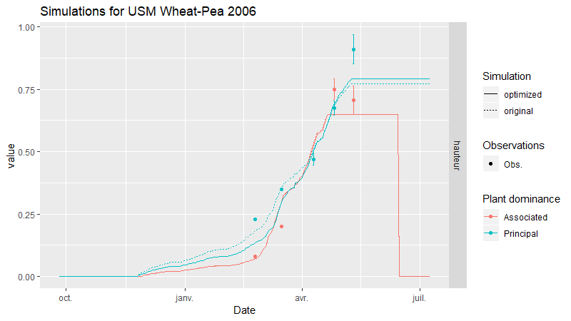
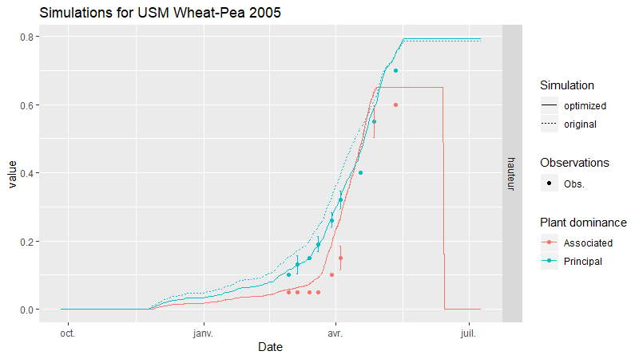

```{r setup, include = FALSE}
knitr::opts_chunk$set(
  collapse = TRUE,
  comment = "#>"
)
```


## Parameter optimization

Parameter values are not always available, or simply cannot be directly measured on the field. Optimization algorithm can help users calibrate a parameter value using measured outputs that depends on the value of the parameter. The [sticRs](https://vezy.github.io/sticRs/) package provide the `optimi_stics()` function that uses the simplex algorithm from Nelder-Mead. The implementation follows the methodology used in the OptimiSTICS matlab library (Wallach et al., 2011). 

The function `optimi_stics()` can be used to optimize one or several parameters at a time using one or several observed variables for one or several USMs.


### Input parameters

The parameters have to be specified as a `data.frame` with four columns: 

* parameter: the parameter name as specified to STICS 
* start: the initial value given to the algorithm (can influence the end-result)
* min: the minimum parameter value allowed
* max: the mximum parameter value allowed

Here is an example parameter `data.frame`:

```{r}
Parameters= data.frame(parameter= c('hautK1','hautA1'),
                       start= c(0.2,0.2),
                       min= c(0,0),
                       max= c(1,1))
Parameters
```


### Single USM, single observed variable

The parameter `data.frame` is used as an argument to `optimi_stics()`. Here is an example of the optimization of the two parameters related to plant height for a single USM for an intercrop: 

```{r eval=FALSE}
library("sticRs")
opti= optimi_stics(dir.orig = "0-DATA/dummy/Year_2005_2006/IC_Wheat_Pea",
                   dir.targ = "2-Simulations/param_optim",
                   stics = "0-DATA/stics_executable/19-new/Stics.exe",
                   obs_name = c("6_IC_Wheat_N0.obs","6_IC_Pea_N0.obs"),
                   Parameters= Parameters,
                   Vars = 'hauteur',
                   method= "nmkb",Plant=1)
```

To make a simulation for a sole crop, simply give one .obs file instead, e.g.: `r obs_name = "6_IC_Pea_N0.obs"`.

In this example, the `hautK1` and `hautA1` parameter values are optimized over one USM for the `hauteur` variable.

### Single USM, several observed variables

We can optimize the parameter values over several observed variables also, by giving them as a vector: 

```{r eval=FALSE}
library("sticRs")
opti= optimi_stics(dir.orig = "0-DATA/dummy/Year_2005_2006/IC_Wheat_Pea",
                   dir.targ = "2-Simulations/param_optim",
                   stics = "0-DATA/stics_executable/19-new/Stics.exe",
                   obs_name = c("6_IC_Wheat_N0.obs","6_IC_Pea_N0.obs"),
                   Parameters= Parameters,
                   Vars = c('lai(n)','masec(n)','hauteur'),
                   method= "nmkb",Plant=1)
```

In this example, the `hautK1` and `hautA1` parameter values are optimized over one USM for the `lai`, the `masec` and the `hauteur` variables at the same time. In general, the user should always keep in mind that parameters should be optimized over variables on which they have the most direct impact. So in this example the user should only use the `hauteur` output variable since the `hautK1` and `hautA1` parameters are directly related to the `hauteur` variable.  
### Several USMs

The parameters can be optimized for several USMs at the same time. This helps getting generic parameter values using several years and/or locations with different pedo-climatic conditions. 

The USMs are specified as a named list such as: 

```{r eval=FALSE}
optimi_stics(dir.orig = list("Wheat-Pea 2005"= "0-DATA/dummy/Year_2005_2006/IC_Wheat_Pea",
                             "Wheat-Pea 2006"= "0-DATA/dummy/Year_2006_2007/IC_Wheat_Pea"),
             dir.targ = "2-Simulations/param_optim",
             stics = "0-DATA/stics_executable/19-new/Stics.exe",
             obs_name = data.frame(Principal= rep("6_IC_Wheat_N0.obs",2),
                                   Associated= rep("6_IC_Pea_N0.obs",2)),
             Parameters = Parameters, weight= 1, Vars = c('hauteur'),
             method= "nmkb",Plant=c(1,1))
```

The parameters will be optimized over all USMs at the same time. Each USM is simulated in parallel to reduce the computation time. If the parameter is in the plant or the technical file for an intercrop, the user can specify the plant for which the parameter has to be optimized for each USM using the `Plant` argument. 

To make a simulation for a sole crop, simply remove the `Associated` row from the `obs_name` argument, e.g.: `robs_name = data.frame(Principal= rep("6_IC_Wheat_N0.obs",2))`.

### Weight

The parameters are optimized over observed variables, but some variables are more important than others. The user can choose to apply a weight to each variable using the `weight` argument. For example, if the user wants to give three times the importance to one variable compared to others, he would put a weight three times higher for this variable:

```{r eval=FALSE}
library("sticRs")
opti= optimi_stics(dir.orig = "0-DATA/dummy/Year_2005_2006/IC_Wheat_Pea",
                   dir.targ = "2-Simulations/param_optim",
                   stics = "0-DATA/stics_executable/19-new/Stics.exe",
                   obs_name = c("6_IC_Wheat_N0.obs","6_IC_Pea_N0.obs"),
                   Parameters= Parameters, weight = c(1,1,3), 
                   Vars = c('lai(n)','masec(n)','hauteur'),
                   method= "nmkb",Plant=1)
```

In this example, the `hauteur` variable will have three times the weight compared to `lai(n)` and `masec(n)`.

### Outputs

The function returns a list of 3: 

* gg_objects: a plot of the simulation for each USM using original parameter values compared to optimized parameter values. 
Here are the plots from the example with two USMs for the heigth variable: 

```{r echo=FALSE,out.width = '100%', fig.cap="Figure 1: hautK1 and hautA1 parameters optimisation: USM 1"}

```

```{r echo=FALSE,out.width = '100%', fig.cap="Figure 1: hautK1 and hautA1 parameters optimisation: USM 2"}

```

* opti_output: the output of the optimization 
* last_sim_data: the outputs of the last simulation with the optimized parameter values

## References

Wallach, D., Buis, S., Lecharpentier, P., Bourges, J., Clastre, P., Launay, M., … Justes, E. (2011). A package of parameter estimation methods and implementation for the STICS crop-soil model. Environmental Modelling & Software, 26(4), 386–394. doi:10.1016/j.envsoft.2010.09.004
